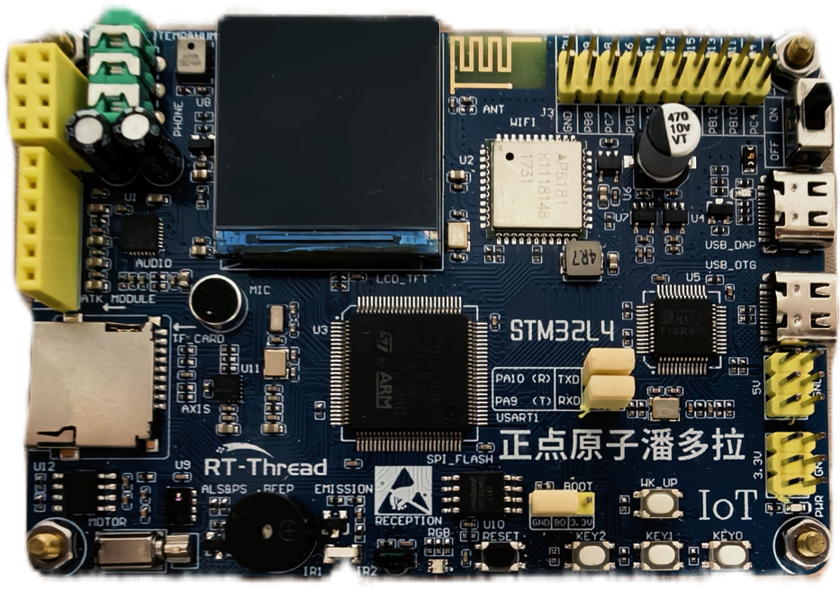

# STM32L496VE 潘多拉开发板 BSP 说明

## 简介

本文档为 STM32L496VE 潘多拉 开发板的 BSP (板级支持包) 说明。

主要内容如下：

- 开发板资源介绍
- BSP 快速上手
- 进阶使用方法

通过阅读快速上手章节开发者可以快速地上手该 BSP，将 RT-Thread 运行在开发板上。在进阶使用指南章节，将会介绍更多高级功能，帮助开发者利用 RT-Thread 驱动更多板载资源。

## 开发板介绍

【此处简单介绍一下开发板】

开发板外观如下图所示：



该开发板常用 **板载资源** 如下：

- MCU：STM32L496VET6，主频 80MHz，512KB FLASH ，320KB RAM
- 外部 FLASH：W25Q128，16MB
- 常用外设
  - LED：1个，（红、绿、蓝三色）
  - 按键：4个，KEY_UP（兼具唤醒功能，PC13），K0（PD10），K1（PD9），K2（PD8）
  - 红外发射头，红外接收头
  - 有源蜂鸣器：1个
  - 光环境传感器：1个
  - 贴片电机：1个
  - 六轴传感器：1个
  - 高性能音频解码芯片：1个
  - 温湿度传感器（AHT10）：1个
  - TFTLCD 显示屏：1个
  - WIFI 模块（AP6181）：1个
  - 板载 ST LINK V2.1 功能
- 常用接口：SD 卡接口、USB OTG、USB-C 接口
- 调试接口，ST-LINK USB-C 接口

开发板更多详细信息请参考【厂商名】 [正点原子潘多拉IoT开发板L496]([潘多拉IoT开发板L496 — 正点原子资料下载中心 1.0.0 文档](http://47.111.11.73/docs/boards/stm32/zdyz_panduola.html))。

## 外设支持

本 BSP 目前对外设的支持情况如下：

| **板载外设**      | **支持情况** | **备注**                              |
| :----------------- | :----------: | :------------------------------------- |
| 板载 ST-LINK 转串口 |     支持     |                                       |
| **片上外设**      | **支持情况** | **备注**                              |
| GPIO              |     支持     | PA0, PA1... PE15 ---> PIN: 0, 1...100 |
| UART              |     支持     | UART1                             |
| SPI               |     暂不支持     | SPI1即将支持                      |
| I2C               |     暂不支持     | 软件 I2C即将支持                          |
| RTC               |   暂不支持   |                               |
| PWM               |   暂不支持   |                                       |
| USB Device        |   暂不支持   |                                       |
| **扩展模块**      | **支持情况** | **备注**                              |

## 使用说明

使用说明分为如下两个章节：

- 快速上手

    本章节是为刚接触 RT-Thread 的新手准备的使用说明，遵循简单的步骤即可将 RT-Thread 操作系统运行在该开发板上，看到实验效果 。

- 进阶使用

    本章节是为需要在 RT-Thread 操作系统上使用更多开发板资源的开发者准备的。通过使用 ENV 工具对 BSP 进行配置，可以开启更多板载资源，实现更多高级功能。


### 快速上手

本 BSP 为开发者提供MDK5 和 IAR 工程。下面以 MDK5 开发环境为例，介绍如何将系统运行起来。

#### 硬件连接

使用数据线连接开发板到 PC，打开电源开关。

#### 编译下载

双击 project.uvprojx 文件，打开 MDK5 工程，编译并下载程序到开发板。

> 工程默认配置使用 xxx 仿真器下载程序，在通过 xxx 连接开发板的基础上，点击下载按钮即可下载程序到开发板

#### 运行结果

下载程序成功之后，系统会自动运行，板载的LED灯会周期性闪烁红光。

连接开发板对应串口到 PC , 在终端工具里打开相应的串口（115200-8-1-N），复位设备后，可以看到 RT-Thread 的输出信息:

```bash
 \ | /
- RT -     Thread Operating System
 / | \     5.3.0 build Feb 12 2026
 2006 - 2024 Copyright by Rt-Thread team
msh >
```
### 进阶使用

此 BSP 默认只开启了 GPIO 和 串口1 的功能，如果需更多高级功能，需要利用 ENV 工具对BSP 进行配置，步骤如下：

1. 在 bsp 下打开 env 工具。

2. 输入`menuconfig`命令配置工程，配置好之后保存退出。

3. 输入`pkgs --update`命令更新软件包。

4. 输入`scons --target=mdk4/mdk5/iar` 命令重新生成工程。

本章节更多详细的介绍请参考 [STM32 系列 BSP 外设驱动使用教程](../docs/STM32系列BSP外设驱动使用教程.md)。

## 注意事项

- PCB丝印有误，印刷为USB_DAP，实际上为STLink V2
- 使用Finsh控制台推荐MobaXterm，一般串口助手无法实时交互

## 联系人信息

维护人:

-  [gohjy-369](https://github.com/gohjy-369), 邮箱：<hejingyang@shu.edu.cn>